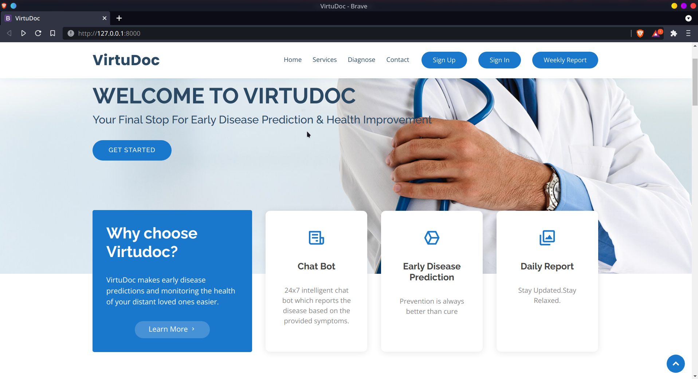

# VirtuDoc

## Installation

`pip install -r requirements.txt`

## Working 

A mini web app, VirtuDoc uses machine learning under the hood in analyzing the user data and predcting the data. Currently the support is only for heart,lung,diabetes and kidney disorder. It was supposed to have a smart watch which takes in wearer's temperature, heart beat etc to analyze the current condition of the wearer.

## Screenshots

